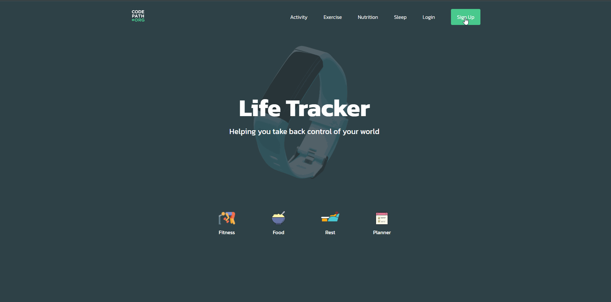
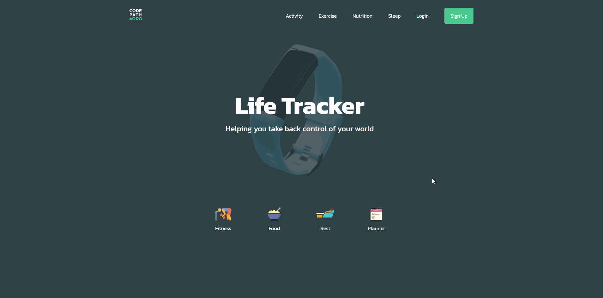

# Project #3: Life Tracker

### Deployed Application: [Lifetracker Deployed Site](https://personal-lifetracker.surge.sh/)

## Overview

Everywhere around us is data waiting to be collected and utilized. In recent years we've seen the rise of applications and services that exist to quantify concepts that were previously hard to capture. FitBit, Apple Health, and Woop are all $1 billion dollar services to offer tracking statistics about how we live our lives. The LifeTracker app you'll be building will do exactly that - track your life by quantifying your activity.

## Application Features

- Allows the user to sign up with their email, password, username, first name, and last name.
- Allows users to log in with email and password.
- When a user first authenticates, they are redirected to an authenticated view (i.e the detailed activity page). When they sign out, all frontend data is reset.
- Allows authenticated users to access their resources and only allows users to access resources about themselves.
- Users have the ability to track three types of activities (Nutrition, Exercise, and Sleep). Each activity is tracked on separate pages.
- Users have access to an overview Activity page that shows summary statistics about each of the 3 types of activity tracked (i.e Total number of minutes exercised, average calories consumed in one day, average hours of sleep in one night, etc.).
- Users have the ability to view, update, and delete previous tracked activities.

## Walkthrough Video

 
 

### Tech Stack Used: React, Node, Express, PostgreSQL
